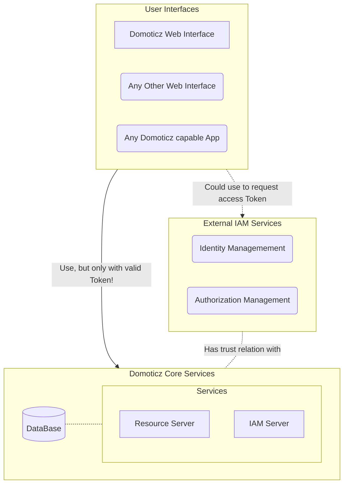

# Domoticz Security Setup

_Applies to version: 2023.1 and up_

This document describes the security options within Domoticz.

By default, any Domoticz installation gets a default User/Password for an _admin_ user as basic protection for the netwerk it is placed in. 

__NOTE__: _First thing to do is changing the default password into something else!_

Usually that network would be someone's private network at home, work, school, barn, car, etc. And for many, if not most, use-cases that is sufficient and what we want. The goal is to measure and control things within the local environment.

But it is a __bad__ idea to connect any installation directly to the internet, as that would mean __anyone anywhere__ can access Domoticz and control connected devices. Could be _fun_ in some edge-cases, but most likely not what anyone would want.

The same applies for _larger_ networks, for example a school or an office, where you do not want just anyone that has access to the network, also get access to Domoticz. Schoolkids would probably love it, but teacher and staff probably not :)

There are a number of 'components'/'functions' involved when it comes to Domoticz security:

* Users
* Trusted networks
* _Clients_
* _Domoticz_
  * The Domoticz __User Interface__ (or _website_. The UI should be regarded as a _client_)
  * The Domoticz __Resource server__ (core server that does all the magic)
  * The Domoticz __'IAM server'__ (Identity & Access Management)
        _(actually part of the core server at the moment)_

A graphical representation looks like this:



## Isn't Domoticz just 1 Application?

Yes and No :)

__From a User perspective;__ often Domoticz is considered as a single application. Until the point where users start using alternative _'tools'_ to access/control their Domoticz setup.

For example when using an alternative- and/or additional Dashboard. An additional _'application'_ gets installed and is connected to the existing Domoticz installation.

Same goes for example when a user starts to use a (native) mobile app. The Users installs an additional app on a mobile device and connects it to the Domoticz installation.

In all these case, the _Resource server_ stays the same, but we change the _UI_. Or just add more _UI's_ that can be used depending on the situation.

__From a development architectural perspective;__ different parts of the Domoticz project/installation are used in different ways and situations.

The core part, the _Resource server_ is always used. It is the heart of the system that holds and controls all devices and data.

Depending on the User(s) environment 1 of more different _User Interfaces (UI's)_ are used to interact with the _resource server_. Each of those different _UI's_ is called a _client_. And a standard Domoticz installation comes with a default _client_, the _web UI_.

When a Domoticz setup becomes either more complex, gets more users, needs connection to the Internet or other less- or insecure networks, it becomes neccessary to add ___SECURITY___. This is where the functions and features of the _IAM server_ comes into play.

### IAM server

Domoticz has a build-in _IAM service_ (part of the core server at the moment) that can be used to handle _Identity_ (Authentication) and _Access_ (Authorization) Management. Here we can define Users and their (access)rights for a (single) Domoticz installation.

But often in larger/complex environments, there usually already is a more centralized _IAM service_, for example a Windows AD (Active Directory) Server or KeyCloak or a Cloud based solution like AWS Incognito or Microsoft's Azure AD.

Also in modern (Hybrid) Cloud environments, a more centralized _IAM service_ is often in place.

Using a centralized _IAM service_, instead of the internal _IAM server_ of each Domoticz installation, makes it much easier the do the on-and offboarding of Users, granting and revoking rights, etc. Also _Single Sign-On_ (SSO) to different applications including one- or more Domoticz installations becomes possible.

And thanks to modern (web)standards like OAuth2, OpenID Connect, etc. different _IAM Services and servers_ become interchangable and interopperable, making the life of sysadmins a little easier.

Due to the now build in support of those standards, Domoticz can become integrated in such environments.

---

## Add user-management

A first step is to further leverage 'User-Management'. User-Management add's a first layer of security by requiring possible users to _identify_ themselves before they get access.

Using the menu 'Setup/Users', additional users can be added to the system.

__NOTE__: It is not a problem to remove the default _admin_ user. But this means that when no other users have been defined, User Management is _turned off_ an now anyone can access Domoticz and gets _admin_ priveleges!

__TIP__: Start with creating a new _admin_ User by giving the user _Admin_ priveleges! So you always have a user to fall back upon if something goes wrong.

__RESCUE TIP__: In case that access to the UI has been lost because no valid (admin) User credentials are known, it is possible to regain access by stopping the Domoticz services and restart it with the `-nowwwpwd` option. Now the missing passwords can be reset. Make sure Domoticz is restarted once more but now _without_ this option to re-activate User-Management.

## Add trusted-networks

Users coming from a _'trusted network'_ do not need to _identify_ themselves.

But when coming from 'outside' a trusted network, Domoticz will require the user to authenticate.

In 'Setup/Settings' on the _security_ tab, there is a section called _'Trusted Networks'_ where IP-addresses and IP-ranges (with wild-cards) can be entered. This ; (semicolon) separated list is used by Domoticz to allow requests coming from clients with an IP-address that falls in one of the listed ranges, to access Domoticz without the need to provide valid credentials.

__NOTE__: Although this functionality seems very handy for easy access to Domoticz for example for scripting and connectivity reasons, it is easy to overlook the possible risks. It is prefered/safer to make sure that scripts, etc. use valid credentials. This has become easier with the use of tokens, so no need to store user credentials in scripts and pass them over the network with each request.

## Add _clients_

_(Applications/UI's that want to communicate with the Domoticz Server)_

Next to _normal_ User Management, it is also possible to register _clients_. Clients are 'applications' that would like to interact with the core Domoticz server to retrieve information and/or perform actions. These applications should/could do so on behalf of registered Users.

Examples of _clients_ are web applications like Dashticz, Reacticz, mobile apps like Domoticz mobile (Xamarin or Android), Domotix, Pilot Home Control or SaaS services as myDomoticz.

_Why do we need clients?_
Basically by having Users with a username/password, we created a way to secure the use of Domoticz _resources_. A given user can be restricted to do only a given number of actions. But the User uses a _client_ (an application) to perform these actions on his/her behalf. The standard Domoticz UI being one of them.

When the Users wants to use other _clients_ as well, the _clients_ also need the Users username/password to perform actions on Domoticz resources (through interaction with the Domoticz resource server.)

The __problem__ is 'how to trust all these _clients_?'. Putting your Domoticz User credentials into a nice app you just installed on your mobile or found as a SaaS service or installed yourself, etc. makes these credentials open to (un)intentional leakage. Once these credentials are leaked, they could be used by any random _client_.

Therefor it is better to tell the 'Domoticz resource server' which _clients_ are allowed to ask for access on behalf of a User when providing User credentials.

Under 'Setup/More Options/Applications' it is possible to add/modify _applications_ that Domoticz may trust to give access to resources on behalf of a user.

The information from an application is used by the _IAM Service_ when handing out Tokens to _clients_ (applications) on behalf of an (authorized) User.

### Generating _secrets_ for _clients_

To be able to generate and sign secure _tokens_, each client needs to have some kind of _secret_.

Such a _secret_ is used to digitally sign the tokendata and is also used to validate if a _token_ is valid.

It is possibe to specify a _secret_ as a passphrase which will be used both for signing and validation. As both the IAM server (for signing) __and__ the Resource server (for validation) need to know this _secret_, it is not considered the most safe option.

It is better to use a _public/private keypair_ where the private key is used to sign the _token_ (by the IAM server) while the public key is used to validate it (by the Resource server).

At the moment of writing (2022), an RSA-PSS (Probabilistic) based keypair using 3072 bits key generation is considered quite safe for the coming years.

See below how to generate such a keypair (in PEM format):

```
openssl genpkey -algorithm rsa-pss -pkeyopt rsa_keygen_bits:3072 > [_yourpemfile_].pem

openssl rsa -pubout -in [_yourpemfile_].pem >> [_yourpemfile_].pem
```

In cases where _token_ generation and signing is done by an external IAM service, only the _public key_ has to be made available for the _client_ in Domoticz.

## Connecting Domoticz to the Internet/Cloud

More and more, Users are looking into ways to control their _Automated Home_ from a distance. So preferably _through the Cloud_. So the Domoticz setup somehow needs to be _accesible_ outside the safe environment of the Home.

This means there is a need to have some kind of _application_ (a _client_) that can access the _resource server_ to perform actions or exchange data.

The _resource server_ always has to be _in the Home_ (local) as here it can safely be connected to the devices it controls. Putting the _resource server_ in the Cloud would mean that all communication between Domoticz and the devices would have to go through the Cloud. That is not a wanted scenario as it poses numerous security risks that are almost impossible to mitigate. And probably not even possible with some/most hardware devices.

That leaves only the _client_ as a candidate to make it accessible/run in the Cloud.

And to make sure that the _client_ can safely interact with the (local) _resource server_, this communication has to be secured. Using Identity and Access Management (IAM) is a good way to secure interaction with the _resource server_.

---

## Supporting web standards

Domoticz tries to leverage best practices and (RFC) standards where possible. Sometimes not all details of each standard are fully implemented or honoured, but we should be as close as possible and fitting with Domoticz as possible. Any diversion, etc. should be well documented (and explained probably).

## OAuth2 support (RFC6749)

At the moment a few flows/grant_types are supported:

* __authorization_code__
* __authorization_code with PKCE__
* __password__
* __refresh_token__

The _implicit_ flow is not implemented as it is not secure. But using _authorization_code flow with the PKCE extension_ is also possible now. PKCE stands for _Proof Key for Code Exchange_.

We do not support _client_credentials_ flow as we do not want 'anonymous' access by a client/application.

To see the details of what is supported by the current _IAM Service_, the specification can be requested through the _well known OpenID Configuration_ endpoint at `https://<yourdomoticz>/.well-known/openid-configuration` which will return something like:

```JSON
{
    "authorization_endpoint": "https://domoticz.local:8443/oauth2/v1/authorize",
    "code_challenge_methods_supported": [
        "S256"
    ],
    "grant_types_supported": [
        "authorization_code",
        "password",
        "refresh_token"
    ],
    "issuer": "https://domoticz.local:8443/",
    "response_types_supported": [
        "code"
    ],
    "token_endpoint": "https://domoticz.local:8443/oauth2/v1/token",
    "token_endpoint_auth_methods_supported": [
        "client_secret_basic"
    ],
    "token_endpoint_auth_signing_alg_values_supported": [
        "PS256",
        "RS256",
        "HS256",
        "HS384",
        "HS512"
    ]
}
```

### Tokens

There are 3 types of _tokens_

* _authorization code_
* _access_token_
* _refresh_token_

### authorization_code flow (with PKCE)

This is the flow that should be used in almost all cases. Preferably using the PKCE extension as it is even more secure.

This flow returns an _access_token_ and an _refresh_token_ but only in the cases where the _authorization_code_ has been given to an registered _client_ application on behalf of an known users. If the _authorization_code_ has been created based on only a registered User, no _refresh_token_ is generated.

### password flow

Using the password flow, one can get an _access_token_ without the need to first obtain an _authorization_code_ by just provider the username/password of a user.

The password flow does NOT return a _refresh_token_, only an _access_token_.

Although this flow is not really regarded as __safe__, as in essense it is as simple as a normal login by providing a username/password, it is offered especially for local automation use-cases. For example for having scripts, etc. being able to communicate with the Domoticz server without the need to send the username/password of a user with each individual request.

Instead it can provide a username/password once to obtain an _access_token_ and than use this _access_token_ till it expires. No need to provide the username/password in the meantime.

Proper scripts,etc. should behave like real _clients_ and use the _authorization_code_ flow instead.

__TO-DO?__ Not implemented yet, but it probably better to limit the _password_ flow only to 'users' (scripts, etc.) that are within in _trusted network_. Otherwise the _password_ flow would also be available for use by 'users' that live outside _trusted networks_ like the Internet.

### Using _refresh_tokens_

The goal of _refresh_tokens_ is to get a new _access_token_, for example when an _access_token_ has expired, without the need for the User to authenticate again to get a new _authorization_code_ to exchange for a new _access_token_.

Instead by providing a (valid) _refresh_token_, a new _access_token_ and _refresh_token_ are handed out immediatly.

A _refresh_token_ also has an expiration date/time (24 hours), but that is much longer than the life-time of an _access_token_ (which is 1 hour).

The use-case is for _clients_ that keep communicating with Domoticz for a longer period of time, for example a Dashboard like Dashticz. Without a _refresh_token_, the Dasboard would require the user the re-login every hour. (Or in a _bad_ implementation, store the users credentials and re-use them each time to re-login). 

Now only at start-up, the Dashboard has to ask for the users credentials and provide these to obtain an _authorization_code_. After that the user credentials are never needed again. Unless the Dashboard has stopped working and the latest _refresh_token_ has expired. Then the user has to re-login as a safety measure.

## PKCE extension (RFC7636)

Proof Key Code Exchange (pronounced "pixy")
More secure auth_code flow for public clients (alternative to depricated implicit flow).

## OpenID Connect (OIDC) support

OpenID Connect adds additional best practices and standards on top of existing standards like OAuth2 and JWT.

At this moment, some OIDC parts are implementend, like support for

* well-known end-point discovery

But other parts like _ID Tokens_ for example are not. Also not everything is fully compliant (yet) with OIDC, but some useful pieces are available and can be leveraged.

## JWT support (RFC7519)

The __access_token__ returned is a so-called _JWT_ (Json Web Token) containing all kind of relevant information and is tamper-proof because it has been digitally signed.

## More reading

https://developer.okta.com/blog/2019/10/21/illustrated-guide-to-oauth-and-oidc

https://developer.okta.com/blog/2019/05/01/is-the-oauth-implicit-flow-dead

https://blog.postman.com/pkce-oauth-how-to/


https://datatracker.ietf.org/doc/html/rfc6749

https://datatracker.ietf.org/doc/html/rfc7636

https://datatracker.ietf.org/doc/html/rfc7519

---

## Future developments and other options

Thanks to the support of open standards like OAuth, JWT, OIDC, etc. it becomes possible to use/integrate Domoticz into environments that use single-signon for example. Also it is possible to use external User Management for example by using an Azure AD, AWS Cognito, API Gateways or Microsoft Active Directy and Federation Services, Okta Identity or Red Hats KeyCloak (or FreeIPA), etc.

Scenario's where a central IAM system provides the User Management functionalities and hands-out the correct tokens, that than can be used by (local) Domoticz Servers. For example when managing multiple locations and installations of Domoticz.
