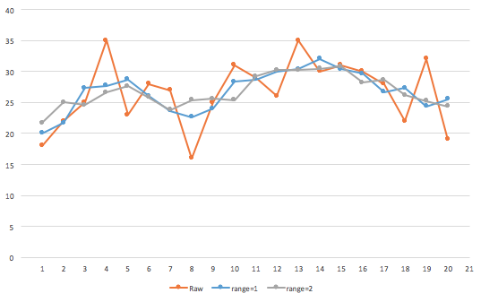

<!-- START doctoc generated TOC please keep comment here to allow auto update -->
<!-- DON'T EDIT THIS SECTION, INSTEAD RE-RUN doctoc TO UPDATE -->
**Table of contents**

- [About](#about)
- [Installing](#installing)
  - [Quickstart](#quickstart)
- [How does it to work?](#how-does-it-to-work)
  - [Adapting or creating your scripts](#adapting-or-creating-your-scripts)
  - [*timer* trigger options](#timer-trigger-options)
- [The domoticz object](#the-domoticz-object)
  - [Domoticz object API](#domoticz-object-api)
    - [Domoticz attributes:](#domoticz-attributes)
    - [Domoticz methods](#domoticz-methods)
    - [Iterators](#iterators)
    - [Contants](#contants)
  - [Device object API](#device-object-api)
    - [Fetching http data](#fetching-http-data)
    - [Device attributes](#device-attributes)
    - [Device methods](#device-methods)
    - [Switch timing options (delay, duration)](#switch-timing-options-delay-duration)
  - [Variable object API](#variable-object-api)
    - [Variable attributes](#variable-attributes)
    - [Variable methods](#variable-methods)
  - [Create your own Time object](#create-your-own-time-object)
    - [Time Properties:](#time-properties)
- [Persistent data](#persistent-data)
  - [Script level persistent variables](#script-level-persistent-variables)
    - [Size matters and watch your speed!!](#size-matters-and-watch-your-speed)
  - [Global persistent variables](#global-persistent-variables)
  - [A special kind of persistent variables: *history = true*](#a-special-kind-of-persistent-variables-history--true)
    - [Historical variables API](#historical-variables-api)
      - [Defining](#defining)
      - [Add](#add)
      - [Getting. It's all about time!](#getting-its-all-about-time)
      - [Interacting with your data: statistics!](#interacting-with-your-data-statistics)
        - [Index](#index)
        - [Time specification (*timeAgo*)](#time-specification-timeago)
        - [Getting data points](#getting-data-points)
          - [Data iterators](#data-iterators)
        - [Statistical functions](#statistical-functions)
          - [Functions](#functions)
        - [About data smoothing](#about-data-smoothing)
  - [How does the storage stuff work?](#how-does-the-storage-stuff-work)
- [Settings](#settings)
- [Final note](#final-note)

<!-- END doctoc generated TOC please keep comment here to allow auto update -->

If you know your way you can go straight to the [Quick Reference Guide](dzVents/QUICKREF.md).

[Release notes](dzVents/dzVents%20history.txt)

# About
dzVents (|diː ziː vɛnts| short for Domoticz Easy Events) brings Lua scripting in Domoticz to a whole new level. Writing scripts for Domoticz has never been so easy. Not only can you define triggers more easily, and have full control over timer-based scripts with extensive scheduling support, dzVents presents you with an easy to use API to all necessary information in Domoticz. No longer do you have to combine all kinds of information given to you by Domoticzs in many different data tables. You don't have to construct complex commandArrays anymore. dzVents encapsulates all the Domoticz peculiarities regarding controlling and querying your devices. And on top of that, script performance has increased a lot if you have many scripts because Domoticz will fetch all device information only once for all your device scripts and timer scripts.

Let's start with an example. Let's say you have a switch that when activated, it should activate another switch but only if the room temperature is above a certain level. And when done, it should send a notification. This is how it looks like in dzVents:

    return {
    	active = true,
    	on = {
    		'Room switch'
    	},
    	execute = function(domoticz, roomSwitch)
    		if (roomSwitch.state == 'On' and domoticz.devices['Living room'].temperature > 18) then
    			domoticz.devices['Another switch'].switchOn()
    			domoticz.notify('This rocks!',
    			                'Turns out that it is getting warm here',
    			                domoticz.PRIORITY_LOW)
    		end
    	end
    }

Or you have a timer script that should be executed every 10 minutes but only on weekdays and have it do something with some user variables and only during daytime:


    return {
    	active = true,
    	on = {
    		['timer'] = {'Every 10 minutes on mon,tue,wed,thu,fri'}
    	},
    	execute = function(domoticz)
    		-- check time of the day
    		if (domoticz.time.isDayTime and domoticz.variables['myVar'].nValue == 10) then
    			domoticz.variables['anotherVar'].set(15)
    			--activate my scene
    			domoticz.setScene('Evening lights', 'On')
    			if (domoticz.devices['My PIR'].lastUpdate.minutesAgo > 5) then
                    domoticz.devices['Bathroom lights'].switchOff()
                end
    		end
    	end
    }

Or you want to detect a humidity rise since the past 5 minutes:

    return {
    	active = true,
    	on = { ['timer'] = 'every 5 minutes },
    	data = { previousHumidity = { initial = 100 } },
    	execute = function(domoticz)
    		local bathroomSensor = domoticz.devices['BathroomSensor']
    		if (bathroomSensor.humidity - domoticz.data.previousHumidity) >= 5) then
    			-- there was a significant rise
    			domoticz.devices['Ventilator'].switchOn()
    		end
    		-- store current value for next cycle
    		domoticz.data.previousHumidity = bathroomSensor.humidity
    	end
    }

Just to give you an idea! Everything that was previously scattered around in a dozen Lua tables is now logically available in the domoticz object structure. From there you can get to all the information and you can control the devices.

# Installing
*First of all, installing dzVents will not affect any of the scripts you have already in place so you can try dzVents without disrupting things.*

Note: this code is *not* tested on a non-linux machine like Windows. I'm almost certain you will have complications.

Download the latest release from [GitHub](https://github.com/dannybloe/dzVents/releases), unzip it.
Form the extracted zip folder copy the following to the Domoticz script folder (`/path/to/domoticz/scripts/lua`):

 -  The `dzVents` folder. This folder contains all the dzVents logic
 - `script_time_main.lua`
 - `script_device_main.lua`
 - `dzVents_settings_example.lua` and
 - the folder `scripts`

After doing so you will have this structure:

    domoticz/
    	scripts/
    		lua/
    			dzVents/
    				... <dzVents files> ...
    				examples/
    				tests/
    			scripts/
    			script_time_main.lua
    			script_device_main.lua
    			dzVents_settings_example.lua
    			... <other stuff that was already there> ...

Now **rename** the file `dzVents_settings_example.lua` to `dzVents_settings.lua`, open the file in an editor and enter the ip number and port number of your Domoticz instance. Make sure that you don't need a username/password for local networks (see Domoticz settings) or dzVents will not be able to fetch additional data like battery status and device type information! If you don't want  or need this then you can set `['Enable http fetch']` to `false` but you will miss some of the handy features if you do so!

The scripts folder is where you put your new Lua event scripts. You can give them any name with the `.lua` extension (no need for *script_device* nor *script_time* prefixing).

## Quickstart
After you placed the dzVents files in the right location we can do a quick test if everything works:

 - Pick a switch in your Domoticz system. Note down the exact name of the switch. If you don't have a switch then you can create a Dummy switch and use that one.
 - Create a new script in the `scripts/` folder. Call it `test.lua`.
 - Open `test.lua` in an editor and fill it with this code and change `<exact name of the switch>` with the .. you guessed it... exact name of the switch device:
```
     return {
    	active = true,
    	on = {
    		'<exact name of the switch>'
    	},
    	execute = function(domoticz, switch)
    		if (switch.state == 'On') then
    			domoticz.notify('Hey!', 'I am on!',
    			domoticz.PRIORITY_NORMAL)
    		else
    			domoticz.notify('Hey!', 'I am off!',
    			domoticz.PRIORITY_NORMAL)
    		end
    	end
    }
```
 - Save the script
 - Open the Domoticz log in the browser
 - In Domoticz (another tab perhaps) press the switch.
 - You can watch the log in Domoticz and it should show you that indeed it triggered your script.
 - Assuming of course that you have configured the notify options in Domoticz. Otherwise you can change the lines with `domoticz.notify` to `domoticz.email(<your address>)`.

The [examples folder](/dzVents/examples) has a couple of example scripts

# How does it to work?
Normally, every time a device is updated in Domoticz it scans the script folder `../domoticz/scripts/lua` and executes *every script it can find starting with script_device* but before it does so, for each and every script, it builds all the necessary global Lua tables. This takes quite some time especially when you have a lot of scripts. Also, you have to program logic in every script to prevent the code from being executed when you don't want to (e.g. the device wasn't updated).

dzVents optimizes this process. All the event scripts that you make using dzVents will have to sit in the scripts folder and the two main script `script_device_main.lua` and `script_time.main.lua` make sure the right event scripts are called. Don't change these two files.

All other scripts can live alongside the dzVents scripts. However, in order to have them work with dzVents you have to adapt them a little (and move them over to the scripts folder).

*Note: there are two other kinds of scripts that Domoticz might call: `script_security..` and `script_variable..`. They will not be affected by dzVents just yet.*

So, how to adapt the scripts?

## Adapting or creating your scripts
In order for your scripts to work with dzVents, they have to be turned into a Lua module. Basically you make sure it returns a Lua table (object) with a couple of predefined keys `active`, `on` and `execute`.. Here is an example:

    return {
        active = true,
        on = {
            'My switch'
        },
        execute = function(domoticz, device)
            -- your script logic goes here, something like this:

            if (device.state == 'On') then
                domoticz.notify('I am on!', '', domoticz.PRIORITY_LOW)
            end
        end
    }

Simply said, if you want to turn your existing script into a script that can be used with dzVents, you put it inside the execute function.

So, the module returns a table with these sections (keys):

    return {
        active = ... ,
        on = { ... },
        data = { ... },
        execute = function(domoticz, device, triggerInfo)
    		...
        end
    }

* **on = { .. }**: (*don't confuse this with **on**/off, it is more like: **on** < some event > **execute** < code >*). This is a Lua table (kind of an array) with **one or more** trigger events:
    * The name of your device between string quotes. **You can use the asterisk (\*) wild-card here e.g. `PIR_*` or `*_PIR` .** Note that in one cycle several devices could have been updated. If you have a script with a wild-card trigger that matches all the names of these changed devices, then this script will be executed *for all these changed devices*.
    * The index of your device (the name may change, the index will usually stay the same),
    * A 'devices' table holding a list of device names or ids: `'devices' = { 'deviceNameA', 'deviceNameB'}`. This can be useful if you have a variable holding the devices that you use for defining the triggers and use in your code.
    * The string or table 'timer' which makes the script execute every minute (see the section **timer trigger options** [below](#timer-trigger-options)).
    * Or a **combination**.

    So you can put as many triggers in there as you like and only if one of those is met, then the **execute** part is executed by dzVents.
* **active = true/false**: this can either be:
	* a boolean value (`true` or `false`, no quotes!). When set to `false`, the script will not be called. This is handy for when you are still writing the script and you don't want it to be executed just yet or when you simply want to disable it.
	* A function returning `true` or `false`. The function will receive the domoticz object with all the information about you domoticz instance: `active = function(domoticz) .... end`. So for example you could check for a Domoticz variable or switch and prevent the script from being executed. **However, be aware that for *every script* in your scripts folder, this active function will be called, every cycle!! So, it is better to put all your logic in the execute function instead of in the active function.** Maybe it is better to not allow a function here at all... /me wonders.
* **execute = function(domoticz, device, triggerInfo)**: This part should be a function that is called by dzVents and contains the actual logic. You can copy the code from your existing script into this section. The execute function receives three possible parameters:
	* the [domoticz object](#domoticz-object-api). This gives access to almost everything in your Domoticz system including all methods to manipulate them like modifying switches or sending notifications. *There shouldn't be any need to manipulate the commandArray anymore.* (If there is a need, please let me know and I'll fix it). More about the domoticz object below.
	* the actual [device](#device-object-api) that was defined in the **on** part and caused the script to be called. **Note: of course, if the script was triggered by a timer event, this parameter is *nil*! You may have to test this in your code if your script is triggered by timer events AND device events**
	* information about what triggered the script. This is a small table with two keys:
		* **triggerInfo.type**: (either domoticz.EVENT_TYPE_TIMER  or domoticz.EVENT_TYPE_DEVICE): was the script executed due to a timer event or a device-change event.
		* **triggerInfo.trigger**: which timer rule triggered the script in case the script was called due to a timer event. See [below](#timer-trigger-options) for the possible timer trigger options. Note that dzVents lists the first timer definition that matches the current time so if there are more timer triggers that could have been triggering the script, dzVents only picks the first for this trigger property.
* **data = { .. }**: A Lua table defining variables that will be persisted between script runs. These variables can get a value in your execute function (e.g. `domoticz.data.previousTemperature = device.temperature`) and the next time the script is executed this value is again available in your code (e.g. `if (domoticz.data.previousTemperature < 20) then ...`. For more info see the section [persistent data](#persistent-data).

## *timer* trigger options
There are several options for time triggers. It is important to know that Domoticz timer events are only trigger once every minute. So that is the smallest interval for you timer scripts. However, dzVents gives you a great many options to have full control over when and how often your timer scripts are called (all times are in 24hr format!). You can create full schedules (sorry about the weird bracket syntax, that's just Lua):

    on = {
        'timer'                            -- the simplest form, causes the script to be called every minute
        ['timer'] = 'every minute',        -- same as above: every minute
        ['timer'] = 'every other minute',  -- minutes: xx:00, xx:02, xx:04, ..., xx:58
        ['timer'] = 'every <xx> minutes',  -- starting from xx:00 triggers every xx minutes
                                           -- (0 > xx < 60)
        ['timer'] = 'every hour',          -- 00:00, 01:00, ..., 23:00  (24x per 24hrs)
        ['timer'] = 'every other hour',    -- 00:00, 02:00, ..., 22:00  (12x per 24hrs)
        ['timer'] = 'every <xx> hours',    -- starting from 00:00, triggers every xx
                                           -- hours (0 > xx < 24)
        ['timer'] = 'at 13:45',            -- specific time
        ['timer'] = 'at *:45',             -- every 45th minute in the hour
        ['timer'] = 'at 15:*',             -- every minute between 15:00 and 16:00
        ['timer'] = 'at 13:45 on mon,tue', -- at 13:45 only on Monday en Tuesday (english)
        ['timer'] = 'every hour on sat',   -- you guessed it correctly
        ['timer'] = 'at sunset',           -- uses sunset/sunrise info from Domoticz
        ['timer'] = 'at sunrise',
        ['timer'] = 'at sunset on sat,sun'

        -- and last but not least, you can create a table with multiples:
        ['timer'] = {'at 13:45', 'at 18:37', 'every 3 minutes'},

    },

**One important note: if Domoticz, for whatever reason, skips a beat (skips a timer event) then you may miss the trigger! So you may have to build in some fail-safe checks or some redundancy if you have critical time-based stuff to control. There is nothing dzVents can do about it**

# The domoticz object
And now the most interesting part. Before, all the device information was scattered around in a dozen global Lua tables like `otherdevices` or `devicechanged`. You had to write a lot of code to collect all this information and build your logic around it. And, when you want to update switches and stuff you had to fill the commandArray with often low-level stuff in order to make it work.

**IMPORTANT: Make sure that all your devices have unique names!! dzVents doesn't check for duplicates!!**

Fear no more: introducing the **domoticz object**.

The domoticz object contains everything that you need to know in your scripts and all the methods (hopefully) to manipulate your devices and sensors. Getting this information has never been more easy:

`domoticz.time.isDayTime` or `domoticz.devices['My sensor'].temperature` or `domoticz.devices['My sensor'].lastUpdate.minutesAgo`.

So this object structure contains all the information logically arranged where you would expect it to be. Also, it harbors methods to manipulate Domoticz or devices. dzVents will create the commandArray contents for you and all you have to do is something like `domoticz.devices[123].switchOn().for_min(5).after_sec(10)` or `domoticz.devices['My dummy sensor'].updateBarometer(1034, domoticz.BARO_THUNDERSTORM)`.

*The intention is that you don't have to construct low-level commandArray-commands for Domoticz anymore!* Please let me know if there is anything missing there. Of course there is a method `domotiz.sendCommand(..)` that allows you to send raw Domoticz commands in case there indeed is some update function missing.

## Domoticz object API
The domoticz object holds all information about your Domoticz system. It has a couple of global attributes and methods to query and manipulate your system. It also has a collection of **devices** and **variables** (user variables in Domoticz) and when applicable, a collection of **changedDevices**. There three collection each have two iterator functions: `forEach(function)` and `filter(function)` to make searching for devices easier. See [iterators](#iterators) below.

### Domoticz attributes:

 - **changedDevices**: *Table*. A collection holding all the devices that have been updated in this cycle.
 - **devices**: *Table*. A collection with all the *device objects*. You can get a device by its name or id: `domoticz.devices[123]` or `domoticz.devices['My switch']`. See [Device object API](#device-object-api) below.
 - **groups**: *Table*: A collection with all the groups. Each group has the same interface as a device. See [Device object API](#device-object-api). Of course a group has far less properties than a regular device.  Only available when [http fetching](#fetching-http-data) is enabled.
 - **scenes**: *Table*: A collection with all the scenes. Each scene has the same interface as a device. See [Device object API](#device-object-api). Of course a scene has far less properties than a regular device.  Only available when [http fetching](#fetching-http-data) is enabled.
 - **security**: Holds the state of the security system e.g. `Armed Home` or `Armed Away`.
 - **time**: Current system time:
	 - **day**: *Number*
	 - **getISO**: *Function*. Returns the ISO 8601 formatted date.
	 - **hour**: *Number*
	 - **isToday**: *Boolean*. Indicates if the device was updated today
	 - **month**: *Number*
	 - **min**: *Number*
 	 - **raw**: *String*. Generated by Domoticz
 	 - **rawDate**: *String*. Returns the date part of the raw data.
 	 - **rawTime**: *String*. Returns the time part of the raw data.
	 - **sec**: *Number*
	 - **year**: *Number*
	 - **isDayTime**
	 - **isNightTime**
	 - **sunsetInMinutes**
	 - **sunriseInMinutes**
 - **variables**: *Table*. A collection holding all the user *variable objects* as defined in Domoticz. See  [Variable object API](#variable-object-api) for the attributes.

### Domoticz methods

 - **email(subject, message, mailTo)**: *Function*. Send email.
 - **fetchHttpDomoticzData**: *Function*. This will trigger a script that will download the device data from Domoticz and stores this on the filesystem for dzVents to use. This data contains information like battery level and device type information that can only be fetched through an http call. Normally dzVents will do this automatically in the background if it is enabled in the `dzVents_settings.lua` file. If you want to do this manually through an event script perhaps (you can use a switch trigger for instance) then you can disable the automatic fetching by changing the setting in `dzVents_settings.lua` and create your own event.
 - **log(message, [level]):** *Function*. Creates a logging entry in the Domoticz log but respects the log level settings. You can provide the loglevel: `domoticz.LOG_INFO`, `domoticz.LOG_DEBUG` or `domoticz.LOG_ERROR`. In `dzVents_settings.lua` you can specify which kind of log message will be printed.
 - **notify(subject, message, priority, sound)**: *Function*. Send a notification (like Prowl). Priority can be like `domoticz.PRIORITY_LOW, PRIORITY_MODERATE, PRIORITY_NORMAL, PRIORITY_HIGH, PRIORITY_EMERGENCY`. For sound see the SOUND constants below.
 - **openURL(url)**: *Function*. Have Domoticz 'call' a URL.
 - **sendCommand(command, value)**: *Function*. Generic command method (adds it to the commandArray) to the list of commands that are being sent back to domoticz. *There is likely no need to use this directly. Use any of the device methods instead (see below).*
 - **setScene(scene, value)**: *Function*. E.g. `domoticz.setScene('My scene', 'On')`. Supports timing options. See below.
 - **sms(message)**: *Function*. Sends an sms if it is configured in Domoticz.
 - **switchGroup(group, value)**: *Function*. E.g. `domoticz.switchGroup('My group', 'Off')`. Supports timing options. See below.

### Iterators
The domoticz object has three collections (tables): devices, changedDevices and variables. In order to make iterating over these collections easier dzVents has two iterator methods so you don't need to use the `pair()` or `ipairs()` function anymore (less code to write):

 1. **forEach(function):** Executes a provided function once per array element. The function receives the item in the collection (device or variable) and the key and the collection itself. If you return *false* in the function then the loop is aborted.
 2. **filter(function):** returns items in the collection for which the function returns true.

Best to illustrate with an example:

    domoticz.devices.forEach(function(device, key)
    	if (device.batteryLevel < 20) then
    		-- do something
    	end
    end)

Or using a filter:

	local deadDevices = domoticz.devices.filter(function(device)
		return (device.lastUpdate.minutesAgo > 60)
	end)
	deadDevices.forEach(function(zombie)
		-- do something
	end)

Of course you can chain:

	domoticz.devices.filter(function(device)
		return (device.lastUpdate.minutesAgo > 60)
	end).forEach(function(zombie)
		-- do something with the zombie
	end)

### Contants

 - **ALERTLEVEL_GREY**, **ALERTLEVEL_GREEN**, **ALERTLEVEL_ORANGE**, **ALERTLEVEL_RED**, **ALERTLEVEL_YELLOW**: For updating text sensors.
 - **BARO_CLOUDY**, **BARO_CLOUDY_RAIN**, **BARO_STABLE**, **BARO_SUNNY**, **BARO_THUNDERSTORM**, **BARO_UNKNOWN**, **BARO_UNSTABLE**: For updating barometric values.
 - **HUM_COMFORTABLE**, **HUM_DRY**, **HUM_NORMAL**, **HUM_WET**: Constant for humidity status.
 - **LOG_DEBUG**, **LOG_ERROR**, **LOG_INFO**: For logging messages.
 - **PRIORITY_LOW**, **PRIORITY_MODERATE**, **PRIORITY_NORMAL**, **PRIORITY_HIGH**, **PRIORITY_EMERGENCY**: For notification priority.
 - **SECURITY_ARMEDAWAY**, **SECURITY_ARMEDHOME**, **SECURITY_DISARMED**: For security state.
 - **SOUND_ALIEN** , **SOUND_BIKE**, **SOUND_BUGLE**, **SOUND_CASH_REGISTER**, **SOUND_CLASSICAL**, **SOUND_CLIMB** , **SOUND_COSMIC**, **SOUND_DEFAULT** , **SOUND_ECHO**, **SOUND_FALLING**  , **SOUND_GAMELAN**, **SOUND_INCOMING**, **SOUND_INTERMISSION**, **SOUND_MAGIC** , **SOUND_MECHANICAL**, **SOUND_NONE**, **SOUND_PERSISTENT**, **SOUND_PIANOBAR** , **SOUND_SIREN** , **SOUND_SPACEALARM**, **SOUND_TUGBOAT**  , **SOUND_UPDOWN**: For notification sounds.
 - **EVOHOME_MODE_AUTO**, **EVOHOME_MODE_TEMPORARY_OVERRIDE**, **EVOHOME_MODE_PERMANENT_OVERRIDE**: for EvoHome set point controlling.


## Device object API
Each device in Domoticz can be found in the `domoticz.devices` collection as listed above. The device object has a set of fixed attributes like *name* and *id*. Many devices though (like sensors) have special attributes like *temperature*, *humidity* etc. These attributes are also available on each device object *when applicable*.

### Fetching http data
Some attributes are not exposed by Domoticz to the event scripts. Fortunately dzVents can fetch this information through http (json call) and extends this missing information to the device data it already got from Domoticz. If you still find some attributes missing you can check the rawData property of a device. Most likely you will find it there:


	domoticz.devices['mySensor'].temperature
	domoticz.devices['myLightSensor'].rawData[1] -- lux value, rawData is an indexed table!

You can control this fetching in the [settings](#settings).

**Important: if you disable fetching http data in the settings then some attributes are not available and you will have to get them from the rawData set yourself. dzVents doesn't know device type information in that case so it doesn't know what is in the raw data it gets from Domoticz.**

### Device attributes

 - **batteryLevel**: *Number* (note this is the raw value from Domoticcz and can be 255). Only available when [http fetching](#fetching-http-data) is enabled.
 - **bState**: *Boolean*. Is true for some common states like 'On' or 'Open' or 'Motion'.
 - **barometer**: Only when applicable.
 - **changed**: *Boolean*. True if the device was changed
 - **counterToday**: *String*. Today's counter value for counter devices. Formatted string with unit. Only available when [http fetching](../README.md/#fetching-http-data) is enabled.
 - **counterTotal**: *String*. Total counter value for counter devices. Formatted string with unit. Only available when [http fetching](../README.md/#fetching-http-data) is enabled.
 - **description**: *String*. Description of the device. Only available when [http fetching](#fetching-http-data) is enabled.Only available when [http fetching](../README.md/#fetching-http-data) is enabled.
 - **deviceSubType**: *String*. See Domoticz devices table in Domoticz GUI. Only available when [http fetching](#fetching-http-data) is enabled.
 - **deviceType**: *String*. See Domoticz devices table in Domoticz GUI. Only available when [http fetching](#fetching-http-data) is enabled.
 - **dewpoint**: Only when applicable.
 - **hardwareName**: *String*. See Domoticz devices table in Domoticz GUI. Only available when [http fetching](#fetching-http-data) is enabled.
 - **hardwareId**: *Number*. See Domoticz devices table in Domoticz GUI. Only available when [http fetching](#fetching-http-data) is enabled.
 - **hardwareType**: *String*. See Domoticz devices table in Domoticz GUI. Only available when [http fetching](#fetching-http-data) is enabled.
 - **hardwareTypeValue**: *Number*. See Domoticz devices table in Domoticz GUI. Only available when [http fetching](#fetching-http-data) is enabled.
 - **humidity**: Only when applicable.
 - **id**: *Number*. Id of the device
 - **lastUpdate**:
	 - **day**: *Number*
	 - **getISO**: *Function*. Returns the ISO 8601 formatted date.
	 - **hour**: *Number*
 	 - **hoursAgo**: *Number*. Number of hours since the last update.
	 - **isToday**: *Boolean*. Indicates if the device was updated today
	 - **month**: *Number*
	 - **min**: *Number*
	 - **minutesAgo**: *Number*. Number of minutes since the last update.
	 - **raw**: *String*. Generated by Domoticz
  	 - **rawDate**: *String*. Returns the date part of the raw data.
 	 - **rawTime**: *String*. Returns the time part of the raw data.
	 - **sec**: *Number*
	 - **secondsAgo**: *Number*. Number of seconds since the last update.
	 - **year**: *Number*
 - **level**: *Number*. For dimmers and other 'Set Level..%' devices this holds the level like selector switches.
 - **lux**: *Number*. Lux level for light sensors.  Only available when [http fetching](#fetching-http-data) is enabled.
 - **name**: *String*. Name of the device
 - **rain**: Only when applicable.
 - **rainLastHour**: Only when applicable.
 - **rawData**: *Table*:  Not all information from a device is available as a named attribute on the device object. That is because Domoticz doesn't provide this as such. If you have a multi-sensor for instance then you can find all data points in this **rawData** *String*. It is an array (Lua table). E.g. to get the Lux value of a sensor you can do this: `local lux = mySensor.rawData[1]` (assuming it is the first value that is passed by Domoticz). Note that the values are string types!! So if you expect a number, convert it first (`tonumber(device.rawData[1]`).
 - **signalLevel**: *String*. See Domoticz devices table in Domoticz GUI. Only available when [http fetching](#fetching-http-data) is enabled.
 - **state**: *String*. For switches this holds the state like 'On' or 'Off'. For dimmers that are on, it is also 'On' but there is a level attribute holding the dimming level. **For selector switches** (Dummy switch) the state holds the *name* of the currently selected level. The corresponding numeric level of this state can be found in the **rawData** attribute: `device.rawData[1]`.
 - **setPoint**: *Number*. Holds the set point for thermostat like devices.  Only available when [http fetching](#fetching-http-data) is enabled.
 - **heatingMode**: *String*. For zoned thermostats like EvoHome. Only available when [http fetching](#fetching-http-data) is enabled.
 - **switchType**: *String*. See Domoticz devices table in Domoticz GUI. Only available when [http fetching](#fetching-http-data) is enabled.
 - **switchTypeValue**: *Number*. See Domoticz devices table in Domoticz GUI. Only available when [http fetching](#fetching-http-data) is enabled.
 - **temperature**: Only when applicable.
 - **text**: Text value for dummy text devices. Only available when [http fetching](#fetching-http-data) is enabled.
 - **timedOut**: *Boolean*. Is true when the device couldn't be reached. Only available when [http fetching](#fetching-http-data) is enabled.
 - **utility**: Only when applicable.
 - **uv**: Only when applicable.
 - **weather**: Only when applicable.
 - **WActual**: *Number*. Current Watt usage. Only available when [http fetching](#fetching-http-data) is enabled.
 - **WhToday**: *Number*. Total Wh usage of the day. Note the unit is Wh and not kWh. Only available when [http fetching](#fetching-http-data) is enabled.
 - **WhTotal**: *Number*. Total Wh (incremental). Only available when [http fetching](#fetching-http-data) is enabled.
 - **winddir**: Only when applicable.
 - **windgust**: Only when applicable.
 - **windspeed**: Only when applicable.

### Device methods

 - **attributeChanged(attributeName)**: *Function*. Returns  a boolean (true/false) if the attribute was changed in this cycle. E.g. `device.attributeChanged('temperature')`.
 - **close()**: *Function*.  Set device to Close if it supports it. Supports timing options. See [below](#switch-timing-options-delay-duration).
 - **dimTo(percentage)**: *Function*.  Switch a dimming device on and/or dim to the specified level. Supports timing options. See [below](#switch-timing-options-delay-duration).
 - **kodiExecuteAddOn(addonId)**: *Function*. Will send an Execute Addon command sending no parameters. Addon IDs are embedded in the addon configuration and are not to be confused with the Addon Name. For example: http://forums.homeseer.com/showthread.php?p=1213403.
 - **kodiPause()**: *Function*. Will send a Pause command, only effective if the device is streaming.
 - **kodiPlay()**: *Function*. Will send a Play command, only effective if the device was streaming and has been paused.
 - **kodiPlayFavorites([position])**: *Function*. Will play an item from the Kodi's Favorites list optionally starting at *position*. Favorite positions start from 0 which is the default.
 - **kodiPlayPlaylist(name, [position])**: *Function*. Will play a music or video Smart Playlist with *name* optionally starting at *position*. Playlist positions start from 0 which is the default.
 - **kodiSetVolume(level)**: *Function*. Set the volume for a Kodi device, 0 <= level <= 100.
 - **kodiStop()**: *Function*. Will send a Stop command, only effective if the device is streaming.
 - **kodiSwitchOff()**: *Function*. Will turn the device off if this is supported in settings on the device.
 - **open()**: *Function*.  Set device to Open if it supports it. Supports timing options. See [below](#switch-timing-options-delay-duration).
 - **setState(newState)**: *Function*. Generic update method for switch-like devices. E.g.: device.setState('On'). Supports timing options. See [below](#switch-timing-options-delay-duration).
 - **stop()**: *Function*.  Set device to Stop if it supports it (e.g. blinds). Supports timing options. See [below](#switch-timing-options-delay-duration).
 - **switchOff()**: *Function*.  Switch device off it is supports it. Supports timing options. See [below](#switch-timing-options-delay-duration).
 - **switchOn()**: *Function*.  Switch device on if it supports it. Supports timing options. See [below](#switch-timing-options-delay-duration).
 - **switchSelector(level)**:  *Function*. Switches a selector switch to a specific level (numeric value, see the edit page in Domoticz for such a switch to get a list of the values). Supports timing options. See [below](#switch-timing-options-delay-duration).
 - **update(< params >)**: *Function*. Generic update method. Accepts any number of parameters that will be sent back to Domoticz. There is no need to pass the device.id here. It will be passed for you. Example to update a temperature: `device.update(0,12)`. This will eventually result in a commandArray entry `['UpdateDevice']='<idx>|0|12'`
 - **toggleSwitch()**: *Function*. Toggles the state of the switch (if it is togglable) like On/Off, Open/Close etc.
 - **updateAirQuality(quality)**: *Function*.
 - **updateAlertSensor(level, text)**: *Function*. Level can be domoticz.ALERTLEVEL_GREY, ALERTLEVEL_GREE, ALERTLEVEL_YELLOW, ALERTLEVEL_ORANGE, ALERTLEVEL_RED
 - **updateBarometer(pressure, forecast)**: *Function*. Update barometric pressure. Forecast can be domoticz.BARO_STABLE, BARO_SUNNY, BARO_CLOUDY, BARO_UNSTABLE, BARO_THUNDERSTORM, BARO_UNKNOWN, BARO_CLOUDY_RAIN
 - **updateCounter(value)**: *Function*.
 - **updateCustomSensor(value)**: *Function*.
 - **updateDistance(distance)**: *Function*.
 - **updateElectricity(power, energy)**: *Function*.
 - **updateGas(usage)**: *Function*.
 - **updateHumidity(humidity, status)**: *Function*. Update humidity. status can be domoticz.HUM_NORMAL, HUM_COMFORTABLE, HUM_DRY, HUM_WET
 - **updateLux(lux)**: *Function*.
 - **updateP1(sage1, usage2, return1, return2, cons, prod)**: *Function*.
 - **updatePercentage(percentage)**: *Function*.
 - **updatePressure(pressure)**: *Function*.
 - **updateRain(rate, counter)**: *Function*. Update rain sensor.
 - **updateSetPoint(setPoint, mode, until)**: *Function*. Update set point for dummy thermostat devices, OpenThermGW and EvoHome Zone devices. This uses http json calls to update setpoints so make sure your [http settings](#settings) are correct. For EvoHome devices mode can be domoticz.EVOHOME_MODE_AUTO, EVOHOME_MODE_TEMPORARY_OVERRIDE or EVOHOME_MODE_PERMANENT_OVERRIDE. You can provide an until date (in ISO 8601 format e.g.: `os.date("!%Y-%m-%dT%TZ")`). Note that there is a bug in the EvoHome code which ignores the time zone so you may have to add/remove some hours depending on your time zone.
 - **updateTemperature(temperature)**: *Function*. Update temperature sensor.
 - **updateTempHum(temperature, humidity, status)**: *Function*. For status options see updateHumidity.
 - **updateTempHumBaro(temperature, humidity, status, pressure, forecast)**: *Function*.
 - **updateText(text)**: *Function*.
 - **updateUV(uv)**: *Function*.
 - **updateVoltage(voltage)**: *Function*.
 - **updateWind(bearing, direction, speed, gust, temperature, chill)**: *Function*.

> "Hey!! I don't see my sensor readings in the device object!! Where is my LUX value for instance?"

That may be because Domoticz doesn't pass all the device data as named attributes. If you cannot find your attribute then you can inspect the **rawData** attribute of the device. This is a table (array) of values. So for a device that has a Lux value you may access it like this:

    local lux = mySensor.rawData[0]

Other devices may have more stuff in the rawData attribute like wind direction, energy info etc etc.

### Switch timing options (delay, duration)
To specify a duration or a delay for the various switch command you can do this:

    -- switch on for 2 minutes after 10 seconds
    device.switchOn().after_sec(10).for_min(2)

    -- switch on for 2 minutes after a randomized delay of 1-10 minutes
    device.switchOff().within_min(10).for_min(2)
    device.close().for_min(15)
    device.open().after_sec(20)
    device.open().after_min(2)

 - **after_sec(seconds)**: *Function*. Activates the command after a certain amount of seconds.
 - **after_min(minutes)**: *Function*. Activates the command after a certain amount of minutes.
 - **for_min(minutes)**: *Function*. Activates the command for the duration of a certain amount of minutes (cannot be specified in seconds).
 - **within_min(minutes)**: *Function*. Activates the command within a certain period *randomly*.

Note that **dimTo()** doesn't support **duration()**.

## Variable object API
User variables created in Domoticz have these attributes and methods:

### Variable attributes

 - **nValue**: *Number*. **value** cast to number.
 - **value**: Raw value coming from Domoticz
 - **lastUpdate**:
	 - **day**: *Number*
	 - **getISO**: *Function*. Returns the ISO 8601 formatted date.
	 - **hour**: *Number*
	 - **hoursAgo**: *Number*. Number of hours since the last update.
	 - **isToday**: *Boolean*. Indicates if the device was updated today
	 - **min**: *Number*
	 - **minutesAgo**: *Number*. Number of minutes since the last update.
	 - **month**: *Number*
	 - **raw**: *String*. Generated by Domoticz
	 - **rawDate**: *String*. Returns the date part of the raw data.
 	 - **rawTime**: *String*. Returns the time part of the raw data.
	 - **sec**: *Number*
	 - **year**: *Number*

### Variable methods

 - **set(value)**: *Function*. Tells Domoticz to update the variable. *No need to cast it to a string first (it will be done for you).*

## Create your own Time object
dzVents comes with a Time object that my be useful to you. This object is used for the various time attributes like `domoticz.time`, `device.lastUpdate`. You can easily create such an object yourself:

    local Time = require('Time')
    local t = Time('2016-12-12 7:35:00') -- must be this format!!

You can use this in combination with the various dzVents time attributes:

    local Time = require('Time')
    local t = Time('2016-12-12 7:35:00')

	local tonight = Time(domoticz.time.rawDate .. ' 20:00:00')
	print (tonight.getISO())
	-- will print something like: 2016-12-12T20:00:00Z

In the future I plan to add some date/time arithmetric

### Time Properties:

 - **day**: *Number*
 - **getISO**: *Function*. Returns the ISO 8601 formatted date.
 - **hour**: *Number*
 - **hoursAgo**: *Number*. Number of hours since the last update.
 - **isToday**: *Boolean*. Indicates if the device was updated today
 - **month**: *Number*
 - **min**: *Number*
 - **minutesAgo**: *Number*. Number of minutes since the last update.
 - **raw**: *String*. Generated by Domoticz
 - **rawDate**: *String*. Returns the date part of the raw data.
 - **rawTime**: *String*. Returns the time part of the raw data.
 - **sec**: *Number*
 - **secondsAgo**: *Number*. Number of seconds since the last update.
 - **year**: *Number*

# Persistent data

In many situations you need to store some device state or other information in your scripts for later use. Like knowing what the state was of a device the previous time the script was executed or what the temperature in a room was 10 minutes ago. Without dzVents you had to resort to user variables. These are global variables that you create in the Domoticz GUI and that you can access in your scripts like: domoticz.variables['previousTemperature'].

Now, for some this is rather inconvenient and they want to control this state information in the event scripts themselves (like me). dzVents has a solution for that: **persistent script data**. This can either be on the script level or on a global level.

## Script level persistent variables

Persistent script variables are available in your scripts and whatever value put in them is persisted and can be retrieved in the next script run.

Here is an example. Let's say you want to send a notification if some switch has been actived 5 times:

    return {
        active = true,
        on = {
    	    'MySwitch'
    	},
        data = {
    	    counter = {initial=0}
    	},
        execute = function(domoticz, switch)
    		if (domoticz.data.counter = 5) then
    			domoticz.notify('The switch was pressed 5 times!')
    			domoticz.data.counter = 0 -- reset the counter
    		else
    			domoticz.data.counter = domoticz.data.counter + 1
    		end
        end
    }

Here you see the `data` section defining a persistent variable called `counter`. It also defines an initial value.  From then on you can read and set the variable in your script.

You can define as many variables as you like and put whatever value in there that you like. It doesn't have to be just a number,  you can even put the entire device state in it:

    return {
        active = true,
        on = {
    	    'MySwitch'
    	},
        data = {
    	    previousState = {initial=nil}
    	},
        execute = function(domoticz, switchDevice)
    	    -- set the previousState:
    		domoticz.data.previousState = switchDevice

    		-- read something from the previousState:
    		if (domoticz.data.previousState.temperature > .... ) then
    		end
        end
    }

**Note that you cannot call methods on previousState like switchOn(). Only the data is persisted.**

### Size matters and watch your speed!!
If you decide to put tables in the persistent data (or arrays) beware to not let them grow as it will definitely slow down script execution because dzVents has to serialize and deserialize the data back and from the file system. Better is to use the historical option as described below.

## Global persistent variables

Next to script level variables you can also define global variables. As script level variables are only available in the scripts that define them, global variables can be accessed and changed in every script. All you have to do is create a script file called `global_data.lua` in your scripts folder with this content:

    return {
    	data = {
    		peopleAtHome = { initial = false },
    		heatingProgramActive = { initial = false }
    	}
    }

Just define the variables that you need and access them in your scripts:

    return {
        active = true,
        on = {
    	    'WindowSensor'
    	},
        execute = function(domoticz, windowSensor)
    		if (domoticz.globalData.heatingProgramActive and windowSensor.state == 'Open') then
    			domoticz.notify("Hey don't open the window when the heating is on!")
    		end
        end
    }

## A special kind of persistent variables: *history = true*

In some situation, storing a previous value for a sensor is not enough and you would like to have more previous values for example when you want to calculate an average over several readings or see if there was a constant rise or decrease. Of course you can define a persistent variable holding a table:

    return {
        active = true,
        on = {
    	    'MyTempSensor'
    	},
    	data = {
    		previousData = { initial = {} }
    	},
        execute = function(domoticz, sensor)
    		-- add new data
    		table.insert(domoticz.data.previousData, sensor.temperature)

    		-- calculate the average
    		local sum = 0, count = 0
    		for i, temp in pairs(domoticz.data.previousData) do
    			sum = sum + temp
    			count = count + 1
    		end
    		local average = sum / count
        end
    }

The problem with this is that you have to do a lot of bookkeeping yourself to make sure that there isn't too much data to store (see [below how it works](#how-does-the-storage-stuff-work)) and many statistical stuff requires a lot of code. Fortunately, dzVents has done this for you:

    return {
        active = true,
        on = {
    	    'MyTempSensor'
    	},
    	data = {
    		temperatures = { history = true, maxItems = 10 }
    	},
        execute = function(domoticz, sensor)
    		-- add new data
    		domoticz.data.temperatures.add(sensor.temperature)

    		-- average
    		local average = domoticz.data.temperatures.avg()

    		-- maximum value in the past hour:
    		local max = domoticz.data.temperatures.maxSince('01:00:00')
        end
    }

### Historical variables API
#### Defining
You define a script variable or global variable in the data section and set `history = true`:

	..
	data = {
		var1 = { history = true, maxItems = 10, maxHours = 1, maxMinutes = 5 }
	}

 - **maxItems**: *Number*. Controls how many items are stored in the variable. maxItems wins over maxHours and maxMinutes.
 - **maxHours**: *Number*. Data older than `maxHours` from now will be discarded.  So if you set it to 2 than data older than 2 hours will be removed at the beginning of the script.
 - **maxMinutes**: *Number*. Same as maxHours but, you guessed it: for minutes this time..
 All these options can be combined but maxItems wins. **And again: don't store too much data. Just put only in there what you really need!**


#### Add
When you defined your historical variable you can new values to the list like this:

    domoticz.data.myVar.add(value)

As soon as you do that, this new value is put on top of the list and shifts the older values one place down the line. If `maxItems` was reached then the oldest value will be discarded.  *All methods like calculating averages or sums will immediately use this new value!* So, if you don't want this to happen set the new value at the end of your script or after you have done your analysis.

Basically you can put any kind of data in the historical variable. It can be a numbers, strings but also more complex data like tables. However, in order to be able to use the statistical methods you will have to set numeric values or tell dzVents how to get a numeric value from you data. More on that later.

#### Getting. It's all about time!
Getting values from a historical variable is basically done by using an index where 1 is the newest value , 2 is the second to newest and so on:

    local item = domoticz.data.myVar.get(5)
    print(item.data)

However, all data in the storage is time-stamped so getting something from the internal storage will get you this:

	local item = domoticz.data.myVar.getLatest()
	print(item.time.secondsAgo) -- access the time stamp
	print(item.data) -- access the data

The time attribute by itself is a table with many properties that help you inspect the data points more easily:

 - **day**: *Number*.
 - **getISO**: *Function*. Returns the ISO 8601 formatted date.
 - **hour**: *Number*
 - **isToday**: *Boolean*.
 - **month**: *Number*
 - **min**: *Number*
 - **minutesAgo**: *Number*.  How many minutes ago from the current time the data was stored.
 - **raw**: *String*. Formatted time.
 - **rawDate**: *String*. Returns the date part of the raw data.
 - **rawTime**: *String*. Returns the time part of the raw data.
 - **sec**: *Number*
 - **secondsAgo**: *Number*. Number of seconds since the last update.
 - **year**: *Number*
 - **utcSystemTime**: *Table*. UTC system time:
	 - **day**: *Number*
	 - **hour**: *Number*
	 - **month**: *Number*
	 - **min**: *Number*
	 - **sec**: *Number*
	 - **year**: *Number*
 - **utcTime**: *Table*. Time stamp in UTC time:
	 - **day**: *Number*
	 - **hour**: *Number*
	 - **month**: *Number*
	 - **min**: *Number*
	 - **sec**: *Number*
	 - **year**: *Number*


#### Interacting with your data: statistics!
Once you have data points in your historical variable you can interact with it and get all kinds of statistical information from the set. Many of the functions needed for this interaction require one or two indexes or a time specification (time ago):

##### Index
All data in the set can be addressed using an index. The item with index = 1 is the youngest and the item with the highest index is the oldest (and beware, if you have called `add()` first, then the first item is that new value!). You can always check the size of the set by inspecting `myVar.size`.

##### Time specification (*timeAgo*)
Every datapoint in the set has a time stamp and of course the set is always ordered so that the youngest item is the first and the oldest item the last. Many functions require you to specify a moment in the past. You do this by passing a string in this format:

    hh:mm:ss

 Where hh is the amount of hours ago, mm the amount of minutes and ss the amount of seconds. They will all be added together and you don't have to consider 60 minute boundaries etc. So this is a valid time specification:

    12:88:03

Which will point to the data point at or around `12*3600 + 88*60 + 3 = 48.483` seconds in the past.
Example:

	-- get average since the past 30 minutes:
	local avg = myVar.avgSince('00:30:00')

##### Getting data points

 - **get( [idx] )**: Returns the idx-th item in the set. Same as `myVar.storage[idx]`.
 - **getAtTime( [timeAgo](#time-specification-timeago) )**: Returns the data point *closest* to the moment as specified by `timeAgo`. So `myVar.getAtTime('1:00:00')` returns the item that is closest to one hour old. So it may be a bit younger or a bit older than 1 hour.
 - **getLatest( ):** Returns the youngest item in the set. Same as `print(myVar.get(1).data)`.
 - **getOldest( )**: Returns the oldest item in the set. Same as `print(myVar.get(myVar.size).data)`.
 - **size**: Return the amount of data points in the set.
 - **subset( [fromIdx], [toIdx] )**:  Returns a subset of the stored data. If you omit `fromIdx` then it starts at 1. If you omit `toIdx` then it takes all items until the end of the set (oldest). So `myVar.subset()` returns all data. The result set supports [iterators](#data-iterators) `forEach`, `filter`, `find` and `reduce`.
 - **subsetSince( [[timeAgo](#time-specification-timeago)] )**: Returns a subset of the stored data since the relative time specified by timeAgo. So calling `myVar.subsetSince('00:60:00')` returns all items that have been added to the list in the past 60 minutes. The result set supports [iterators](#data-iterators) `forEach`, `filter`, `find` and `reduce`.
 - **reset( ):** Removes all the items from the set. Could be handy if you want to start over. It could be a good practice to do this often when you know you don't need older data. For instance when you turn on a heater and you just want to monitor rising temperatures starting from this moment when the heater is activated. If you don't need data points from before, then you may call reset.

###### Data iterators
There are a couple of convenience methods to make looping through the data set easier. This is similar to the iterators as described [above](#iterators):

 - **forEach(function)**:  Loop over all items in the set: E.g.: `myVar.forEach( function( item, index, collection) ... end )`
 - **filter(function)**: Create a filtered set of items. The function receives the item and returns true if the item should be in the result set. E.g. get a set with item values larger than 20: `subset = myVar.filter( function (item) return (item.data > 20) end )`.
 - **find(function)**:  Search for a specific item in the set: E.g. find the first item with a value higher than 20: `local item = myVar.find( function (item) return (item.data > 20) end )`.
 - **reduce(function, initial)**:  Loop over all items in the set and do some calculation with it. You call reduce with the function and the initial value. Each iteration the function is called with the accumulator. The function does something with the accumulator and returns a new value for it. Once you get the hang of it, it is very powerful. Best to give an example. Suppose you want to sum all values:

    	local sum = myVar.reduce(function(acc, item)
			local value = item.data
			return acc + val
		end, 0)

Suppose you want to get data points older than 45 minutes and count the values that are higher than 20 (of course there are more ways to do this):

	local myVar = domoticz.data.myVar

	local olderItems = myVar.filter(function (item)
			return (item.time.minutesAgo > 45)
	end)

	local count = olderItems.reduce(function(acc, item)
		if (item.data > 20) then
			acc = acc + 1
		end
		return acc
	end, 0)

	print('Found ' .. tostring(count) .. ' items')

##### Statistical functions
In order to use the statistical functions you have to put *numerical* data in the set. Or you have to provide a function for getting this data. So, if it is just numbers you can just do this:

    myVar.add(myDevice.temperature) -- adds a number to the set
    myVar.avg() -- returns the average

If, however you add more complex data or you want to do a computation first, then you have to tell dzVents how to get to this data. So let's say you do this to add data to the set:

    myVar.add( { 'person' = 'John', waterUsage = u })

Where `u` is some variable that got its value earlier. Now if you want to calculate the average water usage then dzVents will not be able to do this because it doesn't know the value is actually in the `waterUsage` attribute! You will get `nil`.

To make this work you have to provide a **getValue function** in the data section when you define the historical variable:

    return {
	    active = true,
	    on = {...},
	    data = {
			myVar = {
				history = true,
				maxItems = 10,
				getValue = function(item)
					return item.data.waterUsage -- return number!!
				end
			}
	    },
	    execute = function()...end
    }

This function tells dzVents how to get the numeric value for a data item. **Note: the `getValue` function has to return a number!**.

Of course, if you don't intend to use any of these statistical functions you can put whatever you want in the set. Even mixed data. No-one cares but you.

###### Functions

 - **avg( [fromIdx], [toIdx], [default] )**: Calculates the average of all item values within the range `fromIdx` to `toIdx`. You can specify a `default` value for when there is no data in the set.
 - **avgSince( [timeAgo](#time-specification-timeago), default )**: Calculates the average of all data points since `timeAgo`. Returns `default` if there is no data. E.g.: `local avg = myVar.avgSince('00:30:00')` returns the average over the past 30 minutes.
 - **min( [fromIdx], [toIdx] )**: Returns the lowest value in the range defined by fromIdx and toIdx.
 - **minSince( [timeAgo](#time-specification-timeago) )**: Same as **min** but now within the `timeAgo` interval.
 - **max( [fromIdx], [toIdx] )**: Returns the highest value in the range defined by fromIdx and toIdx.
 - **maxSince( [timeAgo](#time-specification-timeago) )**: Same as **max** but now within the `timeAgo` interval.
 - **sum( [fromIdx], [toIdx] )**: Returns the summation of all values in the range defined by fromIdx and toIdx.
 - **sumSince( [timeAgo](#time-specification-timeago) )**: Same as **sum** but now within the `timeAgo` interval.
 - **delta( fromIdx, toIdx, [smoothRange], [default] )**:  Returns the delta (difference) between items specified by `fromIdx` and `toIdx`. You have to provide a valid range (no `nil` values). [Supports data smoothing](#about-data-smoothing) when providing a `smoothRange` value. Returns `default` if there is not enough data.
 - **deltaSince( [timeAgo](#time-specification-timeago),  [smoothRange], [default] )**: Same as **delta** but now within the `timeAgo` interval.
 - **localMin( [smoothRange], default )**:  Returns the first minimum value (and the item holding the minimal value) in the past. [Supports data smoothing](#about-data-smoothing) when providing a `smoothRange` value. So if you have this range of values in the data set (from new to old): `10 8 7 5 3 4 5 6`.  Then it will return `3` because older values *and* newer values are higher: a local minimum. You can use this if you want to know at what time a temperature started to rise after have been dropping. E.g.:

		local value, item = myVar.localMin()
		print(' minimum was : ' .. value .. ': ' .. item.time.secondsAgo .. ' seconds ago' )
 - **localMax([smoothRange], default)**:  Same as **localMin** but now for the maximum value. [Supports data smoothing](#about-data-smoothing) when providing a `smoothRange` value.
 - **smoothItem(itemIdx, [smoothRange])**: Returns a the value of `itemIdx` in the set but smoothed by averaging with its neighbors. The amount of neighbors is set by `smoothRange`. See [About data smoothing](#about-data-smoothing).

##### About data smoothing
Suppose you store temperatures in the historical variable. These temperatures my have extremes. Sometimes these extremes could be due to sensor reading errors. In order to reduce the effect of these so called spikes, you could smooth out values. It is like blurring the data. Here is an example. The Raw column could be your temperatures. The other columns is calculated by averaging the neighbors. So for item 10 the calucations are:

    Range=1 for t10 = (25 + 31 + 29) / 3 = 28,3
    Range=2 for t10 = (16 + 25 + 31 + 29 + 26) / 5 = 25,4

| Time | Raw | Range=1 | Range=2 |
|------|-----|---------|---------|
| 1    | 18  | 20,0    | 21,7    |
| 2    | 22  | 21,7    | 25,0    |
| 3    | 25  | 27,3    | 24,6    |
| 4    | 35  | 27,7    | 26,6    |
| 5    | 23  | 28,7    | 27,6    |
| 6    | 28  | 26,0    | 25,8    |
| 7    | 27  | 23,7    | 23,8    |
| 8    | 16  | 22,7    | 25,4    |
| 9    | 25  | 24,0    | 25,6    |
| 10   | 31  | 28,3    | 25,4    |
| 11   | 29  | 28,7    | 29,2    |
| 12   | 26  | 30,0    | 30,2    |
| 13   | 35  | 30,3    | 30,2    |
| 14   | 30  | 32,0    | 30,4    |
| 15   | 31  | 30,3    | 30,8    |
| 16   | 30  | 29,7    | 28,2    |
| 17   | 28  | 26,7    | 28,6    |
| 18   | 22  | 27,3    | 26,2    |
| 19   | 32  | 24,3    | 25,3    |
| 20   | 19  | 25,5    | 24,3    |

If you make a chart you can make it even more visible. The red line is not smoothed and clearly has more spikes than the others:



So, some of the statistical function allow you to provide a smoothing range. Usually a range of 1 or 2 is sufficient. I suggest to use smoothing when checking detlas, local minumums and maximums.


## How does the storage stuff work?
For every script file that defines persisted variables (using the `data={ .. }` section) dzVents will create storage file inside a subfolder called `storage` with the name `__data_scriptname.lua`. You can always delete these data files or the entire storage folder if there is a problem with it:

    domoticz/
    	scripts/
			dzVents/
			runtime/
			documentation/
			misc/
			scripts/
				yourscript1.lua
				yourscript2.lua
				global_data.lua
				storage/
					__data_yourscript1.lua
					__data_yourscript2.lua
					__data_global_data.lua

If you dare to you can watch inside these files. Every time some data is changed, dzVents will stream the changes back into the data files.
**And again: make sure you don't put too much stuff in your persisted data as it may slows things down too much.**

# Settings

As mentioned in the install section there is a settings file: dzVents_settings_example.lua. **Rename this file to dzVents_settings.lua**. There you can set a couple of parameters for how dzVents operates:

 - **Domoticz ip**: *Number*. IP-address of your Domoticz instance.
 - **Domoticz port**: *Number*. Port number used to contact Domoticz over IP.
 - **Enable http fetch**: *Boolean*: Controls wether or not dzVents will fetch device data using http. Some information is not passed to the scripts by Domoticz like battery status or group or scene information. dzVents will fetch this data for you using this interval property:
 - **Fetch interval**: *String*. Default is 'every 30 minutes' but you can increase this if you need more recent values in your device objects. See [timer trigger options](#timer-trigger-options).
 - **Log level**: *Number*:
    - 1: Errors,
    - 1.5: Errors + info about the execution of individual scripts and a dump of the commands sent back to Domoticz,
    - 2: Errors + info
    - 3: Debug info + Errors + Info
    - 0: As silent as possible.

    This part is stil a bit experimental and may not give you all the information you need in the logs. Besides, Domoticz tends to choke on too many log messages and may decide not to show them all. You can alway put a print statement here or there or use the `domoticz.log()` API (see [Domoticz object API](#domoticz-object-api)).

# Final note

If you don't want to rewrite all your scripts at once you can have dzVents live along side your other scripts. They do not influence each other at all. You can move your scripts over one by one as you see fit to the scripts folder dzVents uses.

Oh, this code is tested on a linux file system. It should work on Windows. Let me know if it doesn't. There is some code in event_helpers.lua that is need to get a list of all the script in the scripts folder.

Another note: I haven't tested all the various `device.update*` methods. Please let me know if I made any mistakes there or fix them yourselves and create a pull request (or email me) in GitHub.

Good luck and hopefully you enjoy using dzVents.